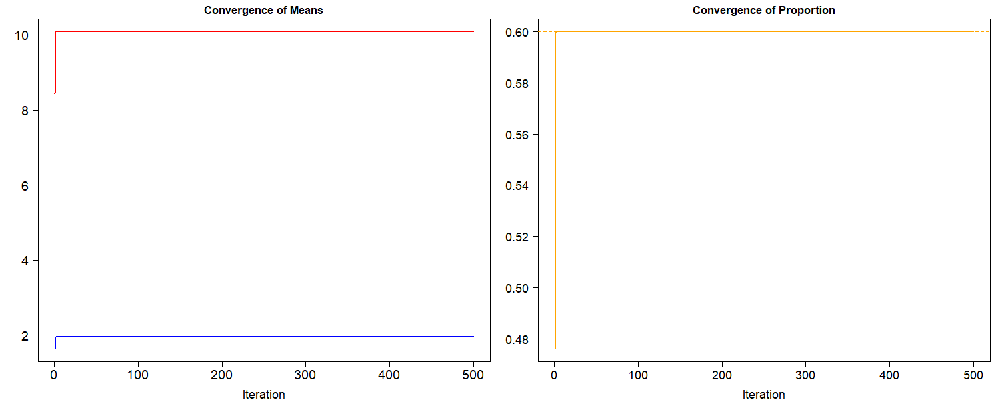
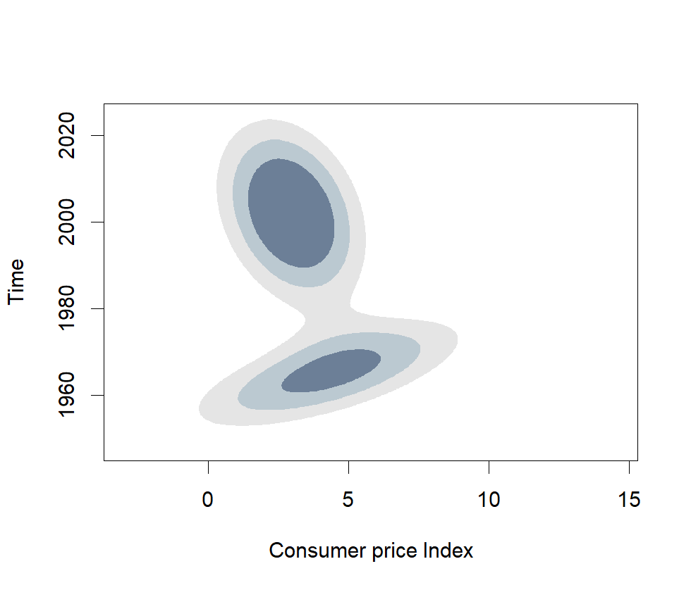
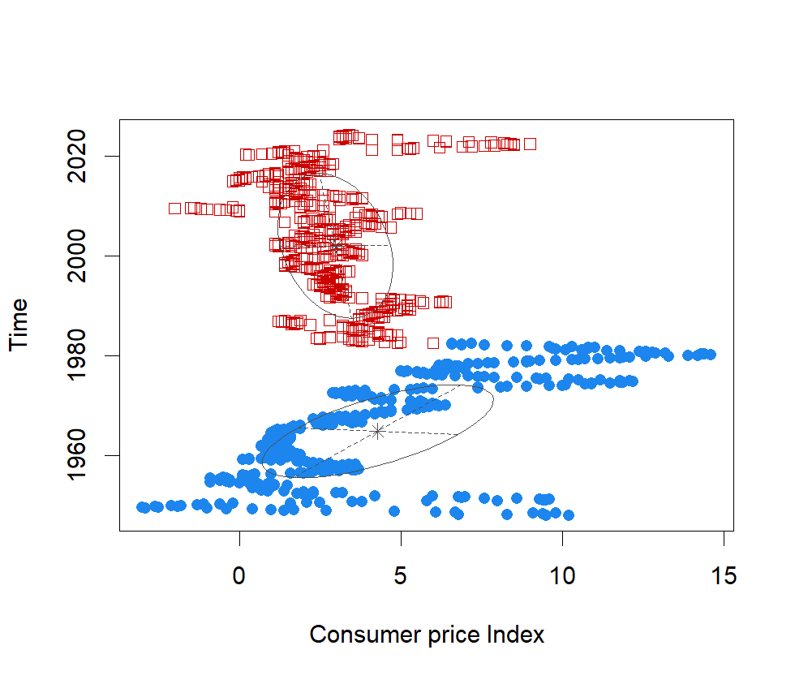

[](http://quantlet.de/)

## [](http://quantlet.de/) **EM-App-CPI** [](http://quantlet.de/)

```yaml

Name of Quantlet: EM-App-CPI

Published in: no publication

Description: Performs a classification of the CPI for the US using a clustering model based on the EM algorithm. Does a simulation for checking convergence.

Keywords: time series, CPI, EM algorithm, clustering, density, convergence

Author: Petre Caraiani

Submitted:  Wed, July 8th 2024 by Petre Caraiani

```





